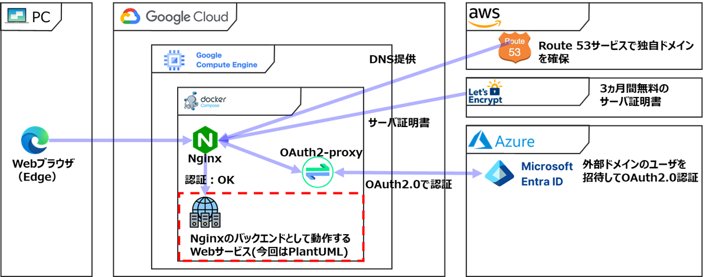

# OAuth2 Proxy + Microsoft Entra ID 認証システム

Microsoft Entra ID（旧Azure AD）を利用したWebアプリケーションの認証・認可システムです。OAuth2/OpenID Connectを使用して、静的コンテンツまたは外部Webアプリケーションへの安全なアクセスを提供します。

## 📋 目次

- [システム概要](#システム概要)
- [アーキテクチャ](#アーキテクチャ)
- [前提条件](#前提条件)
- [セットアップ手順](#セットアップ手順)
- [使用方法](#使用方法)
- [設定詳細](#設定詳細)
- [運用・保守](#運用保守)
- [トラブルシューティング](#トラブルシューティング)

## システム概要



### 特徴

oauth2-proxyはdocker composeでコンテナ実行された既存のサービスをNginxのバックエンドサービスとして登録するだけで、WebサービスのOAuth2.0認証を行うことを目指しています。
構造が少しややこしいので、Nginxコンテナ内のフォルダのマッピングと、Nginxコンテナのポート80と443のフォルダを以下に整理します。

``` nginxコンテナ内のフォルダ
nginxコンテナ内のフォルダ                   ホスト
📁/var/www/certbot
  ┗📁certbot-www                          📁./certbot-www                  (*1)
    ┗📁.well-known                          ┗📁.well-known
      ┗📁acme-challenge                       ┗📁acme-challenge

📁/usr/share/nginx/html                   📁./web                          (*2)
  ┗index.html　         

📁/etc/letsencrypt                        📁./letsencrypt                  (*3)
  ┗📁live

📁/etc/nginx                              
  ┗nginx.conf                              ./nginx/nginx.conf               (*4)
  ┗📁templates
    ┗default.conf.template                 ./nginx/templates/default.conf   (*5)
  ┗📁conf.d                               📁./nginx/conf.d                 (*6)

```
(*1): Let's Encryptのacme Challenge用の空のフォルダ
(*2): バックエンドサービスが無い場合のテスト用のHTMLフォルダ
(*3): Let's Encryptのcertbotがacme Challenge後に書き込むフォルダ(サーバ証明書などが入ります)
(*4): Nginxのグローバル設定(変更する必要はありませんが、必要に応じて変更)
(*5): Nginxの/etc/nginx/conf.d配下のdefault.confを生成するためのテンプレート
      .envのNGINX_SERVER_NAME、NGINX_SERVER_NAME_WWW、NGINX_PROXY_PASSからdefault.confを生成します。
(*6): Nginxがdefault.conf.templateから生成したdefault.confを格納するフォルダ

```nginxコンテナのWebサービス:80ポート
nginxコンテナのWebサービス:80ポート
📁/                                       return 301 https://$host$request_uri; (*1)
  ┗📁.well-known                          ┗📁/var/www/certbot/.well-known
    ┗📁acme-challenge                       ┗📁/var/www/certbot/.well-known/acme-challenge
```
(*1): HTTPアクセスされた場合にHTTPSにリダイレクトします

```nginxコンテナのWebサービス:443ポート
nginxコンテナのWebサービス:443ポート
📁/                                       proxy_pass ${NGINX_PROXY_PASS};   (*1)
📁oauth2                                  proxy_pass http://oauth2-proxy:4180;
  ┗📁/oauth2                              proxy_pass http://oauth2-proxy:4180/oauth2/auth;
```
(*1): .envで設定したNginxのバックエンドサービス
こちらがOAuth2.0で認証するためのサービスです
HTTPのWebサーバを設定します。


### 主要機能

- ✅ Microsoft Entra ID（Azure AD）による認証
- ✅ OAuth2/OpenID Connect認証フロー
- ✅ Redisによる分散セッション管理
- ✅ SSL/TLS終端とリバースプロキシ（nginx）
- ✅ Let's Encrypt自動SSL証明書取得・更新
- ✅ WebSocket接続サポート
- ✅ 外部Webアプリケーションのプロキシ保護

### システム構成要素

| コンポーネント | 役割 | ポート |
|---------------|------|--------|
| **nginx** | TLS終端、リバースプロキシ、認証制御 | 80, 443 |
| **oauth2-proxy** | Azure AD認証仲介、セッション管理 | 4180 (内部) |
| **redis** | 分散セッションストレージ | 6379 (内部) |
| **certbot** | SSL証明書自動取得・更新 | - |

## アーキテクチャ

```
[ユーザー] → [Nginx (TLS終端)] → [OAuth2-Proxy] → [バックエンドアプリケーション]
                     ↓
                [Redis (セッション)]
```

### 認証フロー

#### 🔐 初回アクセス時
1. ユーザーがWebサイトにアクセス
2. Nginxが`auth_request`でOAuth2-Proxyに認証状態を確認
3. 未認証の場合、Azure ADログインページにリダイレクト
4. ユーザーがAzure ADで認証
5. OAuth2-Proxyがコールバックを受信し、Redisにセッションを作成
6. 認証済みとしてWebサイトにリダイレクト

#### ✅ 認証済みアクセス時
1. ユーザーがWebサイトにアクセス
2. Nginxが`auth_request`でOAuth2-Proxyに認証状態を確認
3. Redisからセッションが有効な場合、直接コンテンツを提供

## 前提条件

- 🐳 Docker & Docker Compose
- 🌐 独自ドメイン（SSL証明書取得のため）
- ☁️ Microsoft Entra ID（Azure AD）テナントへの管理者アクセス
- 📧 証明書取得用メールアドレス

## セットアップ手順

### 1. Microsoft Entra IDでのアプリ登録

#### 1.1 アプリの登録

1. [Azure ポータル](https://portal.azure.com) にログイン
2. **Microsoft Entra ID** → **アプリの登録** → **新規登録**
3. 以下の情報を入力：
   - **名前**: 例「oauth2-proxy-local」
   - **サポートされているアカウントの種類**: 「この組織ディレクトリのみに対応」
   - **リダイレクト URI**（種類: Web）: `https://your-domain.com/oauth2/callback`
4. **登録** をクリック

#### 1.2 必要な情報の取得

登録後、以下の情報を控えてください：
- **アプリケーション (クライアント) ID** → `OAUTH2_PROXY_CLIENT_ID`
- **ディレクトリ (テナント) ID** → `OAUTH2_PROXY_AZURE_TENANT`

#### 1.3 クライアント シークレットの作成

1. 左メニュー **証明書とシークレット** → **新しいクライアント シークレット**
2. **説明**・**有効期限** を設定 → **追加**
3. 生成された **値** をコピー → `OAUTH2_PROXY_CLIENT_SECRET`

⚠️ **重要**: シークレットの値は後から再表示できませんので、必ずコピーしてください。

#### 1.4 認証設定の確認

1. 左メニュー **認証**
2. リダイレクト URI `https://your-domain.com/oauth2/callback` が登録されていることを確認

#### 1.5 トークンのクレーム調整（推奨）

1. 左メニュー **トークンの構成** → **オプションクレームの追加**
2. **ID トークン**に `email` を追加
3. 必要に応じて**グループ**クレームも追加（組織内権限制御用）

### 2. 環境設定

#### 2.1 リポジトリのクローン

```bash
git clone https://github.com/potofo/oauth2-proxy.git
cd oauth2-proxy
```

#### 2.2 環境変数ファイルの作成

```bash
cp .env.example .env
```

#### 2.3 `.env`ファイルの編集

```bash
# OAuth2 Proxy Configuration
OAUTH2_PROXY_CLIENT_ID=xxxxxxxx-xxxx-xxxx-xxxx-xxxxxxxxxxxx
OAUTH2_PROXY_AZURE_TENANT=xxxxxxxx-xxxx-xxxx-xxxx-xxxxxxxxxxxx
OAUTH2_PROXY_CLIENT_SECRET=your_client_secret_value
OAUTH2_PROXY_REDIRECT_URL=https://your-domain.com/oauth2/callback
OAUTH2_PROXY_COOKIE_SECRET=your_32_character_secret_key

# Nginx Configuration
NGINX_SERVER_NAME=your-domain.com
NGINX_SERVER_NAME_WWW=www.your-domain.com
NGINX_PROXY_PASS=http://host.docker.internal:8080
```

#### 2.4 Cookie Secretの生成

```bash
# 32文字のランダム文字列を生成
openssl rand -base64 32 | head -c 32
```

### 3. SSL証明書の取得

#### 3.1 ドメインのDNS設定

AレコードでサーバーのグローバルIPアドレスを設定してください。

#### 3.2 Let's Encrypt証明書の取得

```bash
# 一時的なWebサーバーでHTTP-01チャレンジ
docker run --rm -d \
  --name nginx-temp \
  -p 80:80 \
  -v $(pwd)/certbot-www:/var/www/certbot \
  nginx:latest

# 証明書取得
docker run --rm \
  -v $(pwd)/letsencrypt:/etc/letsencrypt \
  -v $(pwd)/certbot-www:/var/www/certbot \
  certbot/certbot:latest \
  certonly --webroot --webroot-path=/var/www/certbot \
  --email your-email@example.com \
  --agree-tos --no-eff-email \
  -d your-domain.com -d www.your-domain.com

# 一時的なWebサーバーを停止
docker stop nginx-temp
```

### 4. システムの起動

```bash
# サービス起動
docker compose up -d

# 起動状況確認
docker compose ps

# ログの確認
docker compose logs -f
```

## 使用方法

### 🌐 基本的な利用の流れ

1. ブラウザで `https://your-domain.com` にアクセス
2. 未認証の場合、Microsoft Entra IDのログイン画面にリダイレクト
3. 組織アカウントでログイン
4. 認証成功後、バックエンドサービスへアクセス可能

### 🔄 バックエンドサービスの変更

[`.env`](.env)ファイルの `NGINX_PROXY_PASS` を変更してサービスを再起動：

```bash
# .envファイルを編集（例：ポート変更）
sed -i 's|http://host.docker.internal:8080|http://host.docker.internal:3000|g' .env

# nginx サービスのみ再起動
docker compose restart nginx
```

### 📊 ユーザー情報の確認

認証済みユーザーの情報を確認：

```bash
# ブラウザで以下にアクセス
https://your-domain.com/oauth2/userinfo
```

### 🔄 セッション管理

```bash
# セッション情報の確認（Redis）
docker compose exec redis redis-cli keys "*"

# 特定ユーザーのセッション削除
docker compose exec redis redis-cli del "session:xxxxxxxxx"
```

## 設定詳細

### 📝 環境変数詳細

| 設定項目 | 説明 | 例 | 必須 |
|---------|------|---|------|
| `OAUTH2_PROXY_CLIENT_ID` | Azure ADアプリのクライアントID | `12345678-...` | ✅ |
| `OAUTH2_PROXY_AZURE_TENANT` | Azure ADのテナントID | `87654321-...` | ✅ |
| `OAUTH2_PROXY_CLIENT_SECRET` | Azure ADアプリのシークレット | `abc123...` | ✅ |
| `OAUTH2_PROXY_REDIRECT_URL` | OAuth2コールバックURL | `https://domain.com/oauth2/callback` | ✅ |
| `OAUTH2_PROXY_COOKIE_SECRET` | Cookie暗号化キー（32文字） | `abcdef1234567890...` | ✅ |
| `NGINX_SERVER_NAME` | プライマリドメイン | `domain.com` | ✅ |
| `NGINX_SERVER_NAME_WWW` | WWWサブドメイン | `www.domain.com` | ✅ |
| `NGINX_PROXY_PASS` | バックエンドURL | `http://host.docker.internal:8080` | ✅ |

### 🔒 セキュリティ設定

OAuth2-Proxyの主要なセキュリティ設定（[`docker-compose.yaml`](docker-compose.yaml)で設定済み）：

```yaml
environment:
  OAUTH2_PROXY_COOKIE_SECURE: "true"         # HTTPS必須
  OAUTH2_PROXY_COOKIE_DOMAINS: ".potofo.net" # Cookie ドメイン制限
  OAUTH2_PROXY_SESSION_STORE_TYPE: "redis"   # Redis セッション
  OAUTH2_PROXY_SET_XAUTHREQUEST: "true"      # ユーザー情報ヘッダー
```

### 🔧 nginx設定のカスタマイズ

[`nginx/templates/default.conf.template`](nginx/templates/default.conf.template)を編集してカスタマイズ可能：

- カスタムヘッダーの追加
- レート制限の設定
- 追加のプロキシ設定
- カスタムエラーページ

## 運用・保守

### 📊 ログ管理

```bash
# 全サービスのログ
docker compose logs -f

# 特定サービスのログ
docker compose logs -f oauth2-proxy
docker compose logs -f nginx
docker compose logs -f redis

# エラーログのみ表示
docker compose logs --since=1h | grep -i error
```

### 🔄 SSL証明書の更新

```bash
# 証明書更新コマンド（3ヶ月に1回cron実行推奨）
docker compose run --rm certbot renew --webroot -w /var/www/certbot && docker compose exec nginx nginx -s reload

# 証明書の有効期限確認
openssl x509 -in letsencrypt/live/your-domain.com/cert.pem -text -noout | grep "Not After"

# cron設定例（3ヶ月に1回、毎月1日の午前2時に実行）
# crontab -e で以下を追加：
# 0 2 1 */3 * cd /path/to/oauth2-proxy && docker compose run --rm certbot renew --webroot -w /var/www/certbot && docker compose exec nginx nginx -s reload
```

### 🔍 ヘルスチェック

```bash
# サービス状態確認
docker compose ps

# oauth2-proxy ヘルスチェック
curl -I http://localhost:4180/ping

# nginx ヘルスチェック
curl -I https://your-domain.com/oauth2/ping
```

### 💾 バックアップ

```bash
# 設定ファイルのバックアップ
tar -czf oauth2-proxy-config-$(date +%Y%m%d).tar.gz \
  .env docker-compose.yaml nginx/ letsencrypt/

# Redis セッションデータのバックアップ（任意）
docker compose exec redis redis-cli --rdb /data/dump.rdb
```

## トラブルシューティング

### ❌ よくある問題と解決方法

#### 1. 認証後にリダイレクトループが発生

**原因**: リダイレクトURLの不一致
```bash
# .envファイルのリダイレクトURLを確認
grep OAUTH2_PROXY_REDIRECT_URL .env

# Azure ADの設定と一致することを確認
```

#### 2. SSL証明書エラー

**原因**: 証明書の期限切れまたは取得失敗
```bash
# 証明書の状態確認
docker compose logs certbot

# 手動で証明書を再取得
docker compose run --rm certbot certonly --webroot \
  --webroot-path=/var/www/certbot \
  --email your-email@example.com \
  --agree-tos -d your-domain.com
```

#### 3. バックエンドサービスに接続できない

**原因**: プロキシ設定の問題
```bash
# バックエンドサービスの疎通確認
curl -I http://host.docker.internal:8080

# nginxの設定確認
docker compose exec nginx nginx -t
```

#### 4. セッションが保持されない

**原因**: Redis接続の問題
```bash
# Redis接続確認
docker exec oauth2-proxy-redis-1 redis-cli -h oauth2-proxy-redis-1 ping

# Redis のログ確認
docker logs oauth2-proxy-redis-1
```

### 🔧 デバッグ用エンドポイント

| エンドポイント | 用途 |
|---------------|------|
| `/oauth2/userinfo` | 認証済みユーザー情報表示 |
| `/oauth2/ping` | oauth2-proxy ヘルスチェック |
| `/oauth2/sign_out` | 手動ログアウト |

### 📞 サポートリソース

- [OAuth2-Proxy 公式ドキュメント](https://oauth2-proxy.github.io/oauth2-proxy/)
- [Microsoft Entra ID ドキュメント](https://docs.microsoft.com/en-us/azure/active-directory/)
- [nginx リバースプロキシガイド](https://docs.nginx.com/nginx/admin-guide/web-server/reverse-proxy/)

---

## 🤝 貢献方法

1. このリポジトリをフォーク
2. フィーチャーブランチを作成 (`git checkout -b feature/amazing-feature`)
3. 変更をコミット (`git commit -m 'Add amazing feature'`)
4. ブランチにプッシュ (`git push origin feature/amazing-feature`)
5. プルリクエストを作成

## 📄 ライセンス

このプロジェクトはMITライセンスの下で公開されています。詳細は[LICENSE](LICENSE.txt)ファイルを参照してください。

---

**注意**: 本番環境での運用前に、必ずセキュリティレビューを実施し、組織のセキュリティポリシーに準拠していることを確認してください。