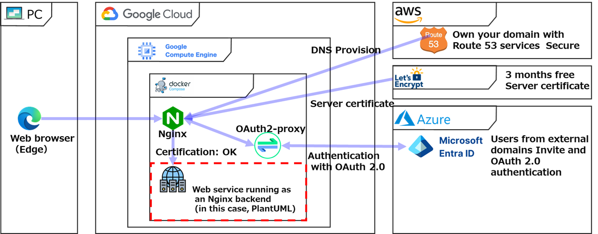

# OAuth2 Proxy + Microsoft Entra ID Authentication System

A web application authentication and authorization system using Microsoft Entra ID (formerly Azure AD). It provides secure access to static content or external web applications using OAuth2/OpenID Connect.

## 📋 Table of Contents

- [System Overview](#system-overview)
- [Architecture](#architecture)
- [Prerequisites](#prerequisites)
- [Setup Instructions](#setup-instructions)
- [Usage](#usage)
- [Configuration Details](#configuration-details)
- [Operations & Maintenance](#operations--maintenance)
- [Troubleshooting](#troubleshooting)

## System Overview



### Key Features

oauth2-proxy aims to provide OAuth2.0 authentication for web services by simply registering existing services running in Docker Compose containers as Nginx backend services.
Since the structure is a bit complex, the folder mapping within the Nginx container and the folders for Nginx container ports 80 and 443 are organized below.

```
Folder mapping within nginx container
Nginx Container Folder                    Host
📁/var/www/certbot
  ┗📁certbot-www                          📁./certbot-www                  (*1)
    ┗📁.well-known                          ┗📁.well-known
      ┗📁acme-challenge                       ┗📁acme-challenge

📁/usr/share/nginx/html                   📁./web                          (*2)
  ┗index.html

📁/etc/letsencrypt                        📁./letsencrypt                  (*3)
  ┗📁live

📁/etc/nginx                              
  ┗nginx.conf                              ./nginx/nginx.conf               (*4)
  ┗📁templates
    ┗default.conf.template                 ./nginx/templates/default.conf   (*5)
  ┗📁conf.d                               📁./nginx/conf.d                 (*6)
```

(*1): Empty folder for Let's Encrypt ACME Challenge
(*2): HTML folder for testing when there's no backend service
(*3): Folder where Let's Encrypt certbot writes after ACME Challenge (contains server certificates, etc.)
(*4): Nginx global configuration (no need to change, but can be modified if necessary)
(*5): Template for generating default.conf under Nginx's /etc/nginx/conf.d
      Generates default.conf from NGINX_SERVER_NAME, NGINX_SERVER_NAME_WWW, and NGINX_PROXY_PASS in .env
(*6): Folder where Nginx stores default.conf generated from default.conf.template

```
Nginx container web service: Port 80
📁/                                       return 301 https://$host$request_uri; (*1)
  ┗📁.well-known                          ┗📁/var/www/certbot/.well-known
    ┗📁acme-challenge                       ┗📁/var/www/certbot/.well-known/acme-challenge
```
(*1): Redirects HTTP access to HTTPS

```
Nginx container web service: Port 443
📁/                                       proxy_pass ${NGINX_PROXY_PASS};   (*1)
📁oauth2                                  proxy_pass http://oauth2-proxy:4180;
  ┗📁/oauth2                              proxy_pass http://oauth2-proxy:4180/oauth2/auth;
```

(*1): Nginx backend service configured in .env
This is the service for OAuth2.0 authentication.
Configure an HTTP web server.

- ✅ Microsoft Entra ID (Azure AD) authentication
- ✅ OAuth2/OpenID Connect authentication flow
- ✅ Distributed session management with Redis
- ✅ SSL/TLS termination and reverse proxy (nginx)
- ✅ Let's Encrypt automatic SSL certificate acquisition and renewal
- ✅ WebSocket connection support
- ✅ Proxy protection for external web applications

### System Components

| Component | Role | Port |
|-----------|------|------|
| **nginx** | TLS termination, reverse proxy, authentication control | 80, 443 |
| **oauth2-proxy** | Azure AD authentication mediation, session management | 4180 (internal) |
| **redis** | Distributed session storage | 6379 (internal) |
| **certbot** | Automatic SSL certificate acquisition and renewal | - |

## Architecture

```
[User] → [Nginx (TLS termination)] → [OAuth2-Proxy] → [Backend Application]
                     ↓
                [Redis (Session)]
```

### Authentication Flow

#### 🔐 First-time Access
1. User accesses the website
2. Nginx checks authentication status with OAuth2-Proxy via `auth_request`
3. If unauthenticated, redirects to Azure AD login page
4. User authenticates with Azure AD
5. OAuth2-Proxy receives callback and creates session in Redis
6. Redirects to website as authenticated user

#### ✅ Authenticated Access
1. User accesses the website
2. Nginx checks authentication status with OAuth2-Proxy via `auth_request`
3. If session is valid in Redis, serves content directly

## Prerequisites

- 🐳 Docker & Docker Compose
- 🌐 Custom domain (for SSL certificate acquisition)
- ☁️ Administrator access to Microsoft Entra ID (Azure AD) tenant
- 📧 Email address for certificate acquisition

## Setup Instructions

### 1. Microsoft Entra ID App Registration

#### 1.1 Register Application

1. Login to [Azure Portal](https://portal.azure.com)
2. **Microsoft Entra ID** → **App registrations** → **New registration**
3. Enter the following information:
   - **Name**: e.g., "oauth2-proxy-local"
   - **Supported account types**: "Accounts in this organizational directory only"
   - **Redirect URI** (type: Web): `https://your-domain.com/oauth2/callback`
4. Click **Register**

#### 1.2 Gather Required Information

After registration, note the following information:
- **Application (client) ID** → `OAUTH2_PROXY_CLIENT_ID`
- **Directory (tenant) ID** → `OAUTH2_PROXY_AZURE_TENANT`

#### 1.3 Create Client Secret

1. Left menu **Certificates & secrets** → **New client secret**
2. Set **Description** and **Expires** → **Add**
3. Copy the generated **Value** → `OAUTH2_PROXY_CLIENT_SECRET`

⚠️ **Important**: The secret value cannot be retrieved later, so make sure to copy it.

#### 1.4 Verify Authentication Settings

1. Left menu **Authentication**
2. Verify that redirect URI `https://your-domain.com/oauth2/callback` is registered

#### 1.5 Token Claims Configuration (Recommended)

1. Left menu **Token configuration** → **Add optional claim**
2. Add `email` to **ID tokens**
3. Add **Groups** claims if needed (for organizational permission control)

### 2. Environment Configuration

#### 2.1 Clone Repository

```bash
git clone <repository-url>
cd oauth2-proxy
```

#### 2.2 Create Environment Variables File

```bash
cp .env.example .env
```

#### 2.3 Edit `.env` File

```bash
# OAuth2 Proxy Configuration
OAUTH2_PROXY_CLIENT_ID=xxxxxxxx-xxxx-xxxx-xxxx-xxxxxxxxxxxx
OAUTH2_PROXY_AZURE_TENANT=xxxxxxxx-xxxx-xxxx-xxxx-xxxxxxxxxxxx
OAUTH2_PROXY_CLIENT_SECRET=your_client_secret_value
OAUTH2_PROXY_REDIRECT_URL=https://your-domain.com/oauth2/callback
OAUTH2_PROXY_COOKIE_SECRET=your_32_character_secret_key

# Nginx Configuration
NGINX_SERVER_NAME=your-domain.com
NGINX_SERVER_NAME_WWW=www.your-domain.com
NGINX_PROXY_PASS=http://host.docker.internal:8080
```

#### 2.4 Generate Cookie Secret

```bash
# Generate 32-character random string
openssl rand -base64 32 | head -c 32
```

### 3. SSL Certificate Acquisition

#### 3.1 Domain DNS Configuration

Set A record with your server's global IP address.

#### 3.2 Acquire Let's Encrypt Certificate

```bash
# Temporary web server for HTTP-01 challenge
docker run --rm -d \
  --name nginx-temp \
  -p 80:80 \
  -v $(pwd)/certbot-www:/var/www/certbot \
  nginx:latest

# Acquire certificate
docker run --rm \
  -v $(pwd)/letsencrypt:/etc/letsencrypt \
  -v $(pwd)/certbot-www:/var/www/certbot \
  certbot/certbot:latest \
  certonly --webroot --webroot-path=/var/www/certbot \
  --email your-email@example.com \
  --agree-tos --no-eff-email \
  -d your-domain.com -d www.your-domain.com

# Stop temporary web server
docker stop nginx-temp
```

### 4. System Startup

```bash
# Start services
docker compose up -d

# Check startup status
docker compose ps

# Check logs
docker compose logs -f
```

## Usage

### 🌐 Basic Usage Flow

1. Access `https://your-domain.com` in your browser
2. If unauthenticated, redirected to Microsoft Entra ID login screen
3. Login with organizational account
4. After successful authentication, access to backend service is available

### 🔄 Changing Backend Service

Modify `NGINX_PROXY_PASS` in [`.env`](.env) file and restart service:

```bash
# Edit .env file (example: change port)
sed -i 's|http://host.docker.internal:8080|http://host.docker.internal:3000|g' .env

# Restart only nginx service
docker compose restart nginx
```

### 📊 Check User Information

Check authenticated user information:

```bash
# Access the following in browser
https://your-domain.com/oauth2/userinfo
```

### 🔄 Session Management

```bash
# Check session information (Redis)
docker compose exec redis redis-cli keys "*"

# Delete specific user session
docker compose exec redis redis-cli del "session:xxxxxxxxx"
```

## Configuration Details

### 📝 Environment Variables Details

| Configuration Item | Description | Example | Required |
|-------------------|-------------|---------|----------|
| `OAUTH2_PROXY_CLIENT_ID` | Azure AD app client ID | `12345678-...` | ✅ |
| `OAUTH2_PROXY_AZURE_TENANT` | Azure AD tenant ID | `87654321-...` | ✅ |
| `OAUTH2_PROXY_CLIENT_SECRET` | Azure AD app secret | `abc123...` | ✅ |
| `OAUTH2_PROXY_REDIRECT_URL` | OAuth2 callback URL | `https://domain.com/oauth2/callback` | ✅ |
| `OAUTH2_PROXY_COOKIE_SECRET` | Cookie encryption key (32 chars) | `abcdef1234567890...` | ✅ |
| `NGINX_SERVER_NAME` | Primary domain | `domain.com` | ✅ |
| `NGINX_SERVER_NAME_WWW` | WWW subdomain | `www.domain.com` | ✅ |
| `NGINX_PROXY_PASS` | Backend URL | `http://host.docker.internal:8080` | ✅ |

### 🔒 Security Configuration

Main security settings for OAuth2-Proxy (configured in [`docker-compose.yaml`](docker-compose.yaml)):

```yaml
environment:
  OAUTH2_PROXY_COOKIE_SECURE: "true"         # HTTPS required
  OAUTH2_PROXY_COOKIE_DOMAINS: ".potofo.net" # Cookie domain restriction
  OAUTH2_PROXY_SESSION_STORE_TYPE: "redis"   # Redis session
  OAUTH2_PROXY_SET_XAUTHREQUEST: "true"      # User info headers
```

### 🔧 Nginx Configuration Customization

Edit [`nginx/templates/default.conf.template`](nginx/templates/default.conf.template) for customization:

- Add custom headers
- Configure rate limiting
- Additional proxy settings
- Custom error pages

## Operations & Maintenance

### 📊 Log Management

```bash
# All services logs
docker compose logs -f

# Specific service logs
docker compose logs -f oauth2-proxy
docker compose logs -f nginx
docker compose logs -f redis

# Show only error logs
docker compose logs --since=1h | grep -i error
```

### 🔄 SSL Certificate Renewal

```bash
# Certificate renewal command (recommended to run with cron every 3 months)
docker compose run --rm certbot renew --webroot -w /var/www/certbot && docker compose exec nginx nginx -s reload

# Check certificate expiration
openssl x509 -in letsencrypt/live/your-domain.com/cert.pem -text -noout | grep "Not After"

# Cron configuration example (every 3 months, 1st day at 2 AM)
# Add to crontab -e:
# 0 2 1 */3 * cd /path/to/oauth2-proxy && docker compose run --rm certbot renew --webroot -w /var/www/certbot && docker compose exec nginx nginx -s reload
```

### 🔍 Health Checks

```bash
# Check service status
docker compose ps

# oauth2-proxy health check
curl -I http://localhost:4180/ping

# nginx health check
curl -I https://your-domain.com/oauth2/ping
```

### 💾 Backup

```bash
# Backup configuration files
tar -czf oauth2-proxy-config-$(date +%Y%m%d).tar.gz \
  .env docker-compose.yaml nginx/ letsencrypt/

# Backup Redis session data (optional)
docker compose exec redis redis-cli --rdb /data/dump.rdb
```

## Troubleshooting

### ❌ Common Issues and Solutions

#### 1. Redirect Loop After Authentication

**Cause**: Redirect URL mismatch
```bash
# Check redirect URL in .env file
grep OAUTH2_PROXY_REDIRECT_URL .env

# Verify it matches Azure AD configuration
```

#### 2. SSL Certificate Error

**Cause**: Certificate expired or acquisition failed
```bash
# Check certificate status
docker compose logs certbot

# Manually re-acquire certificate
docker compose run --rm certbot certonly --webroot \
  --webroot-path=/var/www/certbot \
  --email your-email@example.com \
  --agree-tos -d your-domain.com
```

#### 3. Cannot Connect to Backend Service

**Cause**: Proxy configuration issue
```bash
# Check backend service connectivity
curl -I http://host.docker.internal:8080

# Check nginx configuration
docker compose exec nginx nginx -t
```

#### 4. Session Not Persisted

**Cause**: Redis connection issue
```bash
# Check Redis connection
docker exec oauth2-proxy-redis-1 redis-cli -h oauth2-proxy-redis-1 ping

# Check Redis logs
docker logs oauth2-proxy-redis-1
```

### 🔧 Debug Endpoints

| Endpoint | Purpose |
|----------|---------|
| `/oauth2/userinfo` | Display authenticated user information |
| `/oauth2/ping` | oauth2-proxy health check |
| `/oauth2/sign_out` | Manual logout |

### 📞 Support Resources

- [OAuth2-Proxy Official Documentation](https://oauth2-proxy.github.io/oauth2-proxy/)
- [Microsoft Entra ID Documentation](https://docs.microsoft.com/en-us/azure/active-directory/)
- [nginx Reverse Proxy Guide](https://docs.nginx.com/nginx/admin-guide/web-server/reverse-proxy/)

---

## 🤝 Contributing

1. Fork this repository
2. Create a feature branch (`git checkout -b feature/amazing-feature`)
3. Commit your changes (`git commit -m 'Add amazing feature'`)
4. Push to the branch (`git push origin feature/amazing-feature`)
5. Create a Pull Request

## 📄 License

This project is licensed under the MIT License. See the [LICENSE](LICENSE) file for details.

---

**Note**: Before production deployment, ensure security review is conducted and compliance with organizational security policies is verified.

## Reffer URL
- https://chatgpt.com/share/e/68d79a24-5988-800c-8f1d-63ac8532dc2b
